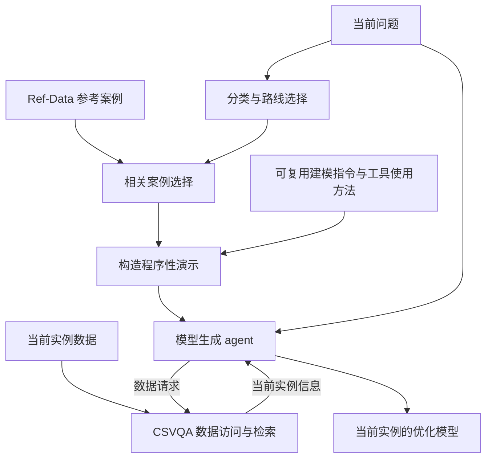

# LEAN-LLM-OPT：knowledge、skills、RAG 与 AE1 回复

核查日期：2026-10-04。本报告是针对 AE1 的概念与文献核查，不是新的效果实验，也不是穷尽式系统综述。英文回复、蓝色正文建议和 BibTeX 位于同一目录。

## 1. 建议采用的结论

**LEAN-LLM-OPT 是一个 agentic workflow construction framework。它将参考建模知识、可复用的类别建模程序和目标数据访问结合起来，由 agent 应用于当前实例。其类别程序在功能上具有 skill-like 特征，RAG 是获取相关案例和实例数据的机制之一。**

这里既不需要把整套 LEAN 重命名为 skill library，也不应将 skills 与 RAG 写成互相排斥的方案。

必须纠正此前容易造成混淆的两种说法：

- “RAG 是知识，skill 是流程”不够准确：RAG 是机制，其检索对象可以包含事实、数据、案例及程序；skill 本身组织的就是程序性知识，并可包含其他参考知识。
- “把检索放进 skill 只是封装”过于笼统：skill 可以包含真正执行读取、检索、处理的程序。如果仅改变文件组织而不改变方法，不能声称新增能力；若同时改进适用条件、调用步骤或结果处理，改变就不止是封装。当前论文只解释已有程序，不暗示这些额外改进已经实现。

## 2. 三个概念分别回答什么问题

| 概念 | 核心含义 | 在运输问题中的例子 |
| --- | --- | --- |
| Knowledge | 可用于理解和解决问题的信息与方法知识 | 供给约束的含义、参考模型、怎样把字段映射为模型参数 |
| RAG | 检索外部材料，并以检索结果辅助生成 | 找到相似例题后构造演示；CSVQA 找到当前数据后返回数据回答 |
| Skill | 围绕某类任务组织的可复用程序性指导及配套资源 | 何时采用运输建模程序、如何取得供需和成本信息、怎样构造模型 |

**Knowledge 不仅指事实。** Declarative knowledge 通常指事实、概念、关系等；procedural knowledge 指完成任务的方法。例如，“供给上限是多少”提供当前实例事实，“怎样识别供给字段并用于约束”提供方法。Li et al. (2024) 用这一区分分析 LLM 解题信息，但也承认两类信息在具体提示中可能交织。[原文](https://aclanthology.org/2024.lrec-main.980.pdf)

**Skill 是程序知识的一种组织和使用方式。** 现代 LLM-agent 文献常将它表达为具有适用范围、指令和辅助资源的可复用单元；这不要求每次执行相同步骤、返回相同结果，也不要求自主学习。OpenAI 给出的是具体文件组织：SKILL.md 加可选 references、scripts、assets；学术上的程序复用并不都采用这一格式。[综述 §II-D](https://arxiv.org/html/2605.07358v3#S2.SS4)、[OpenAI 文档](https://developers.openai.com/api/docs/guides/tools-skills)

**RAG 可以运行在 skill 内部。** 指令可以要求 agent 查询资料，程序可以实现查询，返回内容可以支持后续任务。因此，同一组件可以在机制层面采用 RAG，在任务组织层面成为 skill 的组成部分。OpenAI 明确允许 skill 指导搜索与内容获取工具。[官方说明](https://developers.openai.com/plugins/concepts/skills)

资料少且稳定时，skill 配套参考文件可能足以省去一个独立的检索系统；资料量大或需按当前查询选择时，skill 仍可调用检索。即使检索程序被放进 skill，检索这一操作依然存在。这是对文档的设计解释，不是 OpenAI 宣布 skills 普遍替代 RAG。

## 3. 与 LEAN 的逐项对应

核对文件：`/Users/cora/Downloads/main (3).tex`、当前 `LEAN_LLM_OPT_4.1_Large-scale-or.ipynb` 及相关配置。此前 V2 文件目前不可读取，本报告未将其视为本次审计对象。

| LEAN 部分 | 内容或操作 | 概念上的角色 |
| --- | --- | --- |
| Ref-Data | 问题、参考数据、专家模型、相关数据标注 | 外部案例型建模知识；演示化后也可表达程序信息 |
| Classification / FileQA | 参考问题检索和分类推理 | 确定当前问题适用的类别路线 |
| 类别参考检索 | 选择对应类别的相关案例 | 为演示提供参考内容 |
| 工作流构建 | 将案例内容嵌入建模指令、工具步骤、观察与答案结构 | 把内容和方法组织成可供下游使用的程序性演示 |
| CSVQA | 读取目标数据、检索并生成相关数据回答 | 可复用的数据访问操作；提供当前实例的信息 |
| Model generation | 按演示和工具观察适配变量、约束、系数及输出 | 在当前任务中应用知识和程序 |
| Others / Mixture | 利用共享指导及当前 query/schema 生成抽象计划 | 当前实例的计划构建，不代表自动积累新类别技能 |

图中展示 type-tailored 路线的功能关系，不表示代码为每个框配置了一个独立 LLM。当前 notebook 主要由 Python 将参考内容填入既定演示结构；不要将这种实例化扩写为“自主学习新的工作流拓扑”。

**具体例子。** TP 路线读取参考实例的需求、供给、成本文件，将逐行数据写入演示的 Observation；当前实例的数据另外读取、索引，并由 CSVQA 返回相关内容。下游 agent 以当前数据构建模型。当前 TP 检索阶段用的是行文本，不能将其误述成显式构造 u、d 和成本矩阵后检索。论文中的“把数据对应到模型组件”是方法层面的解释，与该具体数据表示方式相容。

固定的是参考资源、类别程序、工具接口与指令；变化的是选中的参考、数据请求、观察、计划及模型。**可复用方法固定与单次执行动态并不矛盾。** 也没有发现将完成的轨迹蒸馏成新技能再用于未来任务的机制；保存实验日志不等于技能学习。

## 4. 文献分别支持什么

### 4.1 Li et al. (2024)：知识的作用区分

*Meta-Cognitive Analysis: Evaluating Declarative and Procedural Knowledge in Datasets and Large Language Models*，LREC-COLING 2024。作者 Zhuoqun Li、Hongyu Lin、Yaojie Lu、Hao Xiang、Xianpei Han、Le Sun。[正式论文](https://aclanthology.org/2024.lrec-main.980/)

方法：根据题目及正确答案构造事实提示和步骤提示，比较无提示、事实、步骤及组合条件，分析不同模型和任务需要什么信息。结论是两类提示的作用取决于任务与模型。

**对 LEAN 的启发：** 用它解释“提供哪些信息”与“怎样完成建模”的功能区别；不用它把整份 Ref-Data 判为纯 declarative knowledge。该实验使用根据答案构造的提示，不是对实际 RAG 或 skills 的效果验证。

### 4.2 Lewis et al. (2020)：RAG 是检索与生成结合的方法

*Retrieval-Augmented Generation for Knowledge-Intensive NLP Tasks*，NeurIPS 2020。Patrick Lewis 等。[会议论文](https://proceedings.neurips.cc/paper/2020/hash/6b493230205f780e1bc26945df7481e5-Abstract.html)

方法：把可检索的 Wikipedia 索引与参数化生成模型结合；生成依赖检索段落，检索器与生成相关组件参与训练。论文比较不同文档条件化方案并报告问答等任务上的收益。

**对 LEAN 的启发：** 外部材料可以在生成时提供所需依据，且这可以与参数学习协同。不能据此说 LEAN 复现了原论文全部算法，也不能说 RAG 的对象只能是事实或自然语言文档。

### 4.3 Rubin, Herzig and Berant (2022)：检索参考演示

*Learning To Retrieve Prompts for In-Context Learning*，NAACL-HLT 2022。[论文](https://aclanthology.org/2022.naacl-main.191/)

EPR 检索输入—输出示例。训练时用语言模型生成正确输出的条件概率评价候选示例，再据此训练双编码器检索器；在 BREAK、MTOP、SMCalFlow 等结构化预测任务上优于所比较的基线。

**对 LEAN 的启发：** 例题的价值包括展示输入到结构化输出的映射；参考选择可以考虑对建模的实际帮助。它直接对应参考演示选择，不直接验证 CSV 参数提取，也不意味着检索到的例题自动成为独立 skill。

### 4.4 Yang et al. (2024)：检索与实例化程序模板

*Buffer of Thoughts: Thought-Augmented Reasoning with Large Language Models*，NeurIPS 2024。Ling Yang 等。[论文](https://proceedings.neurips.cc/paper_files/paper/2024/hash/cde328b7bf6358f5ebb91fe9c539745e-Abstract-Conference.html)

方法：保存抽象 thought templates，为新问题检索并具体化模板，再由 buffer manager 更新模板库；在十个推理任务上进行评估。

**对 LEAN 的启发：** 检索可以提供程序性模板；同一模板可适配不同输入。因此动态执行不否定方法复用。但 LEAN 当前没有该论文的模板提炼与持续更新机制。

### 4.5 Sumers et al. (2024)：程序知识可以体现在代码里

*Cognitive Architectures for Language Agents*（CoALA），TMLR 2024。Theodore R. Sumers、Shunyu Yao、Karthik Narasimhan、Thomas L. Griffiths。[原文 §4.1](https://arxiv.org/html/2309.02427v3#S4.SS1)

CoALA 用记忆、动作与决策过程组织 agent。它明确讨论模型权重中的隐式程序知识，以及 agent 代码中的显式程序知识；后者包括推理、检索和决策程序。

**对 LEAN 的启发：** 程序性能力不能只归因于 prompt，CSVQA 与工作流构建代码也承载可复用操作。这是概念框架，不是 OpenAI 文件规范，也不能直接证明 LEAN 的性能。

### 4.6 Zhou et al. (2026)：现代 agent skill 的组成

*A Comprehensive Survey on Agent Skills: Taxonomy, Techniques, and Applications*，arXiv:2605.07358v3。Yingli Zhou、Shu Wang、Yaodong Su、Wenchuan Du、Yixiang Fang、Xuemin Lin。[定义 §II-D](https://arxiv.org/html/2605.07358v3#S2.SS4)

它将 skill 表示为指令文档、辅助资源和适用条件的组合，允许纯文本和人工来源；资源可以包括文档、模板及脚本，不要求所有组成项均显式实现。

**对 LEAN 的启发：** 类别路线、建模程序和参考资源与这些组成部分有功能对应。这是称为 skill-like 的依据，不是 LEAN 已采用独立技能包格式的证明。综述没有对 LEAN 做新效果实验。

### 4.7 Li et al. (2026)：skill 包的操作定义与评估

*SkillsBench: Benchmarking How Well Agent Skills Work Across Diverse Tasks*，arXiv:2602.12670v4。Xiangyi Li 等。[原文，尤其附录 M.1](https://arxiv.org/html/2602.12670v4#A13.SS1)

它以 SKILL.md 与可选资源组织程序性内容，在不同任务和执行配置中评估技能包。其收录标准排除主要提供事实背景的 RAG 检索，同时承认边界非绝对、skill 可以包含参考资料和例题。

**对 LEAN 的启发：** 需要区分程序复用思想与具体包规范。它不支持“RAG 与 skill 不能共存”，也不支持把任意工具直接称为符合标准的 skill。

### 4.8 Wang et al. (2025)：从经历中归纳可复用工作流

*Agent Workflow Memory*（AWM），ICML 2025，PMLR 267:63897–63911。Zora Zhiruo Wang、Jiayuan Mao、Daniel Fried、Graham Neubig。[正式论文](https://proceedings.mlr.press/v267/wang25bx.html)

AWM 从任务轨迹归纳常用子流程，用抽象槽位替代实例细节，并以工作流记忆指导后续任务；同时研究预先归纳的 offline 模式和逐任务积累的 online 模式。

**对 LEAN 的启发：** 工作流可跨任务复用且允许执行变化。区别在于 AWM 归纳并保存流程，LEAN 主要应用预先整理的程序与参考。测试时固定不是否定 skill 的理由。论文的实验证据来自网页任务。

### 4.9 Yang et al. (2026)：面向优化建模的技能学习

*OptSkills: Learning Generalizable Optimization Skills from Problem Archetypes via Cluster-Based Distillation*，arXiv:2605.29829v2。Haochen Yang、Ke Zhao、Mengyuan Ma、Xingyu Lu、Xiangfeng Wang、Hong Qian。作者在 arXiv 注明 Findings of EMNLP 2026 接收；此处沿用已核查的 v2。[原文](https://arxiv.org/html/2605.29829v2)

方法：按结构原型组织优化问题，从建模求解轨迹提炼流程和错误经验，并细化或扩充技能库；正式测试时冻结技能库。

**对 LEAN 的启发：** 最直接的连接是按优化结构组织程序知识。实质差异是轨迹驱动的技能蒸馏与维护，对比 LEAN 的预先整理指导及外部实例数据适配。其附录 E.5 在 Without CSV 协议下复现 LEAN，不能将该结果与原论文的 CSV 测试结果直接比较。

### 4.10 OpenAI 官方文档：确认能否组合，不替代论文证据

官方允许 reference material、scripts 和工具使用说明；也展示如何由 skill 组合 search/fetch 工具。[Skills](https://developers.openai.com/api/docs/guides/tools-skills)、[Skills and tools](https://developers.openai.com/plugins/concepts/skills)

它们足以支持“skill 可以包含知识并使用检索”。它们不是同行评议的科学定义，也未给出“把 RAG 改名为 skill 就获得同等或更好效果”的结论。

## 5. AE 回复的论证顺序

1. 接受 AE 的建议，将类属参考的作用拆解为建模知识与其应用程序。
2. 用 Li 定义两类知识，同时说明案例可表达两者。
3. 用 Lewis、EPR、BoT 解释 RAG 是机制，检索内容不限事实；明确 LEAN 包含参考检索及目标数据访问。
4. 用 Zhou 和 OpenAI 说明 skill 的复用对象、辅助资源和工具调用；指出 RAG 可在 skill 内运行。
5. 回到三个 agent 的分工，说明参考演示怎样指导当前数据建模。将 skill-like 属性归于可复用的指令和程序实现，不只归于 prompt。
6. 用 SkillsBench、AWM、OptSkills 说明表示方式和学习机制的差别；不把动态执行或缺少自主学习当作否定 skill 的理由。
7. 保持 agentic workflow construction framework 的定位，说明与 fine-tuning 兼容，并报告只修改 §1.2 和 §3.3。

最终英文回复见 AE1_response_blue.tex；完整可预览版见 AE1_response_document.tex。

**回复中不要声称：** RAG 等于知识；RAG 与 skill 二选一；每个检索结果都是 skill；动态工作流无法体现 skill；测试期间固定就不是 skill；没有自主学习就不是 skill；LEAN 已实现独立技能库；所引文献证明 LEAN 的各组成部分具有独立效果；LEAN 普遍优于 fine-tuning。

## 6. 正文如何配合

仅建议替换或完善作者已确认新增的两处：

- §1.2 Related Works 末尾的 **Knowledge and Skills in LLM Agents**：放概念、相关文献和与现有研究的关系，避免复述实现细节。
- §3.3 Novelties in Our Design and Key Messages 中的 **Connecting Reference Knowledge and Modeling Skills**：紧接现有结构化工作流讨论，写 LEAN 的具体角色分工、两类检索、固定指导与动态实例化，以及没有跨任务技能学习。

可粘贴蓝色文字见 manuscript_additions_blue.tex。当前可读取的 main (3).tex 没有这两个新增标题，可能不是作者最近修改的副本；本次没有改写该文件。AE 回复末段使用作者已确认的两个新增标题，提交前应将新增内容与回复核对一致。

## 7. 引用选择

AE 完整回复保留 Li、Lewis、EPR、BoT、Zhou、SkillsBench、AWM、OptSkills 及两份官方文档，分别承担明确论点。CoALA 作为解释程序实现的补充，纳入 BibTeX 备用；无需为了数量再叠加更多技能库论文。

如果最终需要缩短，可把 EPR、BoT 留在正文综述，在回复中保留一条概括；不能删除 CSVQA 对当前实例数据的作用，也不应只留下“我们没有技能库”的防御性解释。

本轮未运行新实验，未改代码，也未声称修改整篇论文或原始 reply letter。新增文件为作者可审阅的说明、回复与正文建议。
