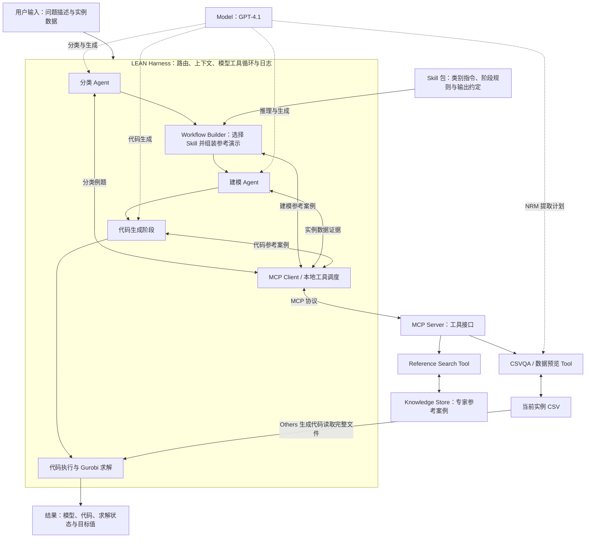

# LEAN 全流程搭建：Harness、Agent、Model、Skill、MCP 和工具

基于 `LEAN_LLM_OPT_4.1_Large-scale_0927.ipynb`。本文是完整搭建方案；尚未实施整套迁移，未运行新的模型实验。原 notebook 和 AE 回复文档均未修改。

## 一、先明确系统关系

不是 Harness → MCP → Agent → Model → Skill 的单链条。

Harness 是运行与协调层；Agent 是执行某个角色的配置和运行过程；Model 提供推理与生成；Skill 提供该角色使用的可复用程序指导；Tool 执行具体操作；MCP 是 Harness 接入部分工具的协议。

Agent 可以理解为“角色指令 + 当前上下文 + 可调用工具 + 对模型的调用和结果处理”。多个 agent 角色可以使用同一个 GPT-4.1，不需要多个不同基础模型，也不一定各自是独立服务。

建模、代码生成可以分别运行，也可以是一个 agent 的两个阶段。为了可比性，应先保留 notebook 原有边界。

Knowledge 有不同形式。案例库保存专家问题、数据、模型和代码；Skill 指令本身也表达程序性知识。因此，知识与技能不是完全互斥的文件类别。

## 二、总体架构



实线表示主要流程与内容传递；虚线表示模型能力被使用。这是建议架构，并不是当前 notebook 已经建立 MCP 服务的证明。

图中的工具后端可以直接本地调用；增加 MCP 接口时仍复用同一套函数。Gurobi 执行先留在本机运行环境，不要求通过 MCP。

NRM 的 CSVQA 内部也调用模型生成提取计划，所以数据工具在当前设计中是一个复合工具，而非纯数据库查询。

## 三、完整搭建步骤

### 第 1 步：建立输入与输出契约

运行输入只包含允许交给模型的当前问题和数据位置。建议：

```python
TaskInput(query, dataset_address, task_id)
```

运行状态分阶段记录：

```text
classification: predicted_label, assigned_route, reference_ids
formulation: skill_version, demonstration, formulation, data_evidence
code_generation: code_references, generated_code
execution: runnable_code, solver_status, objective, variable_values
trace: model/embedding versions, tool calls, errors, usage, payload hashes
```

这些是建议字段，不是现有 notebook 统一结构的声明。评估真值、正确类别和目标值只保存在 evaluator；不进入 agent 上下文或工具参数。task_id 仅用于追踪，不用来针对题号改变建模。

### 第 2 步：提取原有运行配置

固定 `gpt-4.1-2025-04-14` 与现有 embedding 配置。保留超时、重试、ReAct 边界、prompt 渲染与错误处理。

先使用当前 LangChain 模型调用和 agent 循环作为执行后端，在外层搭建 Harness。以后换 SDK、function calling 或模型，单独记录并验证。

不能假设 GPT-4.1 因为读取了 SKILL.md 就自动获得全部最新托管技能 API 能力。首版可以自建 skill loader，由 Harness 读取文件和组装上下文。

### 第 3 步：建立 Skill 注册与阶段资源

建议六条建模 route：NRM、RA、TP、AP、FLP、Others，并另设分类指导。

```text
skills/
  classify-optimization/SKILL.md
  nrm-modeling/
    SKILL.md
    references/formulation.md
    references/data-extraction.md
    references/code-generation.md
  resource-allocation/SKILL.md
  transportation/SKILL.md
  assignment/SKILL.md
  facility-location/SKILL.md
  general-optimization/SKILL.md
```

SKILL.md 描述适用场景与可复用过程。原有长提示可拆成阶段资源，按分类、建模、代码生成的实际需求装载。不要把全部技能全文一次性塞给所有角色。

Skill 路由先由当前分类结果和代码策略决定，保留 Mixture/Others 共用 Others；无 CSV 时保留通用路径。无需新增一个自动挑选 skill 的模型调用。

技能中可引用共享案例库与工具，不必复制整个案例库。选到的案例和目标数据是当前执行的动态内容，不改变技能方法的可复用性。

首次迁移要对比最终模型收到的提示。将 SKILL.md 新增文字放进模型上下文本身可能改变行为，不能仅凭指令含义相近宣称完全等价。

### 第 4 步：建立案例与实例数据后端

案例库先沿用 `RAG_Examples_All.csv`。分类索引与建模索引保持原有差别：分类索引含 prompt 与 Type；类别内建模索引嵌入 prompt，并返回结构化案例字段。

建议工具：

| 工具 | 输入 | 输出 | 现有实现 |
|---|---|---|---|
| search_classification_examples | 当前结构描述 | 五个分类参考例题 | fileqa_retrieve |
| search_reference_cases | route、query、k | 相关案例及原始字段 | retrieve_rag_examples |
| csvqa | 当前工具查询；任务上下文由运行层绑定 | planned/legacy 数据证据与状态 | build_csvqa_components |
| preview_instance_data | 当前任务的数据标识与 query | schema、预览与统计证据 | csv_schema_preview |

返回参考问题、数学模型、相关数据和代码，是 knowledge retrieval。随后模型基于这些内容分类或生成，是系统的 RAG 机制。检索工具不需要另加一次“生成参考答案”的模型调用。

数据访问保持不同路线：

- NRM：构建 profile → LLM 提取计划 → Python 执行 → 验证或完整数据回退。
- RA/TP/AP/FLP：全部源行进入模型上下文 → 模型选行 → 校验来自源数据 → 必要时返回全部源行。
- Others：生成数据预览 → 生成抽象计划 → 生成读取完整文件的代码。

legacy 行校验保证输出行的来源和保真，不等同于证明相关行全部覆盖。语义向量搜索通常也不能保证优化模型所需数据完整；不要用案例向量搜索直接替换精确数据提取。

### 第 5 步：建立 MCP server 和 client

一个 MCP server 就可以暴露参考搜索和数据工具，不需要每个技能一个服务。

底层函数负责 FAISS 检索、表读取、计划执行与验证；MCP 层负责工具名称、描述、输入结构、输出和传输。Harness 中的 MCP client 连接服务、发现工具并调用。

推荐第一版使用本地服务，让 CSV 和求解环境仍在当前机器。若改成远程服务，必须上传或挂载数据；本机路径字符串不能让远程机器自动获得文件。

对于有任务上下文的 CSVQA，可采用：Harness 注册任务 → 获得 task_id → 工具调用携带 task_id 与 query → 服务端绑定该任务的 route、原始问题和文件。服务端应验证任务属于当前会话。不要依赖 MCP 服务器的全局“当前任务”，以免并发串数据。

兼容现有 ReAct 时，Harness 可以将 MCP 工具包装成原来的 FileQA/CSVQA 接口：模型仍输出现有工具调用，包装函数通过 MCP 获取结果。这允许先保持现有模型与调用方式。

分类与数据工具由 agent 请求；原有自动参考演示与代码参考搜索可以继续由 Harness/Builder 主动调用。并非所有 MCP 调用都必须由模型自主决定。

### 第 6 步：定义 Agent 和 Workflow Builder

分类 Agent：保留原有类别定义、边界规则和一次 FileQA 协议。

Workflow Builder：选择 route 对应技能、检索案例、渲染参考演示、绑定数据工具。标准 route 的这部分主要是程序化组装，不需要为名称“agent”额外加入 LLM。

建模 Agent：基于当前问题、技能指导、参考演示和当前数据证据生成模型。

代码生成阶段：根据当前模型、数据证据和代码参考生成 Gurobi 程序。Others 保留自己的两阶段逻辑。

这些角色都可使用同一 GPT-4.1 客户端。业务处理的真正执行仍由工具与 Gurobi 完成。

### 第 7 步：实现 Harness 运行过程

```text
1. 接收 query 与当前数据位置；建立独立任务状态。
2. 分类 Agent 调用 FileQA，取得五个例题，输出七类之一。
3. Harness 映射到执行 route，并按有无 CSV 保留原有路由规则。
4. Skill loader 读取对应建模指导。
5. Workflow Builder 获取参考案例，并渲染当前建模演示。
6. Harness 运行建模过程；处理模型请求的 CSVQA 调用并返回证据。
7. 获取模型/计划；按 route 运行代码生成。
8. 组装可执行程序：NRM 保留结构化 CSVQA_DATA 注入。
9. 执行并读取 Gurobi 状态、目标值和变量解。
10. 保存模型、数据证据、代码、解和各阶段日志。
11. evaluator 单独对照真值计算实验指标。
```

建模内部的循环：

```text
Harness 发送 instruction + context → Model
Model 返回工具请求 → Harness 校验与调度
Harness 经本地接口/MCP 调用工具 → 工具返回数据
Harness 将工具结果加入上下文 → 再次调用 Model
Model 返回最终模型 → Harness 检查阶段协议并进入代码生成
```

Skill 不替代这个循环；MCP 不替代 Harness；Tool 不等于 Model。

### 第 8 步：求解与运行边界

保留当前代码清理、NRM 数据注入、Gurobi 模型对象及状态检查。求解操作先由 Harness 自动安排，而非新增一个让模型自主决定是否求解的 agent。

后续可以改为独立执行进程或容器，便于管理运行环境和资源。那属于运行后端变化，应明确验证，而不能声称只是 MCP 封装。

失败时记录阶段、工具状态和上下文，不自动新增修复循环。增加自动修复会改变实验预算与算法，应单独评估。

## 四、以 NRM 为例的一次完整执行

1. 用户提交收益管理问题及 CSV。
2. 分类 Agent 检索五个带标签例题，判为 NRM。
3. Harness 选择 nrm-modeling skill。
4. Builder 在 NRM 案例索引内检索一个参考问题；用该问题、参考数据观察和专家模型组成演示。
5. 建模 Agent 读取当前问题、演示和 NRM 指导，调用 CSVQA 一次。
6. CSVQA 对目标 CSV 构建 profile；内部模型生成提取计划；Python 执行并返回验证后的数据。
7. 建模 Agent 生成符号模型与 Data Mapping，依据当前问题确定域、约束和目标。
8. 代码阶段检索两个候选代码参考，按现有逻辑处理空 Code，并基于当前模型与结构化数据生成代码。
9. Harness 将 CSVQA_DATA 注入程序，执行 Gurobi。
10. 保存目标值、解、生成代码及引用/工具追踪。

参考案例中的数值不替代目标 CSV；技能指导不替代当前问题约束。生成的 workflow/plan 是本次实例化结果，不自动写回技能库。

## 五、各 route 必须保留的差别

| Route | 建模参考数 | CSVQA 调用 | 数据方式 | 输出 |
|---|---:|---|---|---|
| NRM | 1 | 恰好一次 | planned | 符号模型 + Data Mapping |
| RA | 3 | 恰好一次 | legacy | 数值模型 |
| TP | 3 | 至少一次 | legacy | 数值模型 |
| AP | 1 | 至少一次 | legacy | 模型与必要参数、资格条件 |
| FLP | 1 | 至少一次 | legacy | 模型与参数、ID/矩阵方向 |
| Others，有 CSV | 3 | 使用自身流程 | preview + 完整文件读取 | 计划 + 代码 |

分类固定五个例题。标准 route 的代码参考搜索保留 k=2。无 CSV 的流程单独保留。

## 六、实施与验收顺序

1. 拆分现有函数与 prompt，建立本地 Harness；先验证提示渲染、数据和路由。
2. 建立技能文件和加载器；保留已有阶段指导，验证加载结果。
3. 给工具添加 MCP 接口与兼容包装，比较本地/MCP 返回值、顺序、错误和状态。
4. 回放已生成的代码，检查执行结果；选各 route 代表问题验证端到端。
5. 若新增指令、模型调用方式或提取过程，再设计方法对比实验。

需要关注调用次数、案例顺序、源行标识、过滤计划、数据哈希、完整约束、代码执行和目标值。随机生成不能保证逐字一致；既验证确定性边界，也评估实际输出。

架构封装的预期收益是维护、复用、互操作与追踪。是否提高建模正确率需要实验，不能仅由采用 Skill/MCP 得出。

## 七、官方资料

- Skills：https://developers.openai.com/api/docs/guides/tools-skills
- Build skills：https://learn.chatgpt.com/docs/build-skills
- MCP：https://developers.openai.com/plugins/concepts/mcp-server
- Retrieval：https://developers.openai.com/api/docs/guides/retrieval
- Agents API architecture：https://developers.openai.com/api/docs/guides/agents-api/architecture

OpenAI 托管 Harness 是一项特定产品实现。这里为保留 GPT-4.1 基准建议自建 Harness，不要求迁移到托管 Codex。
