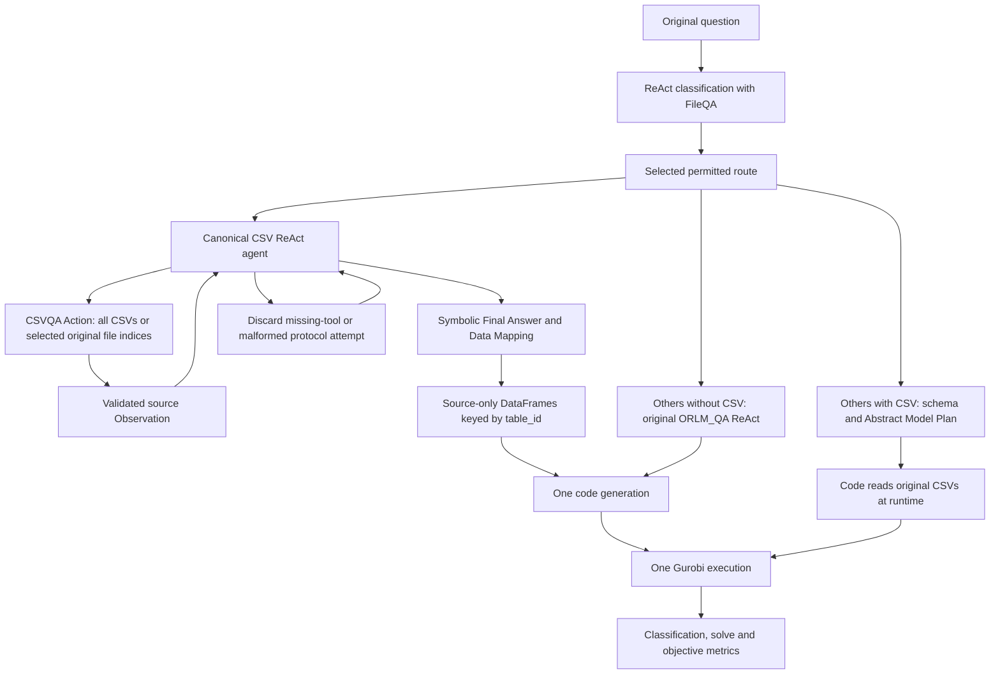

# ReAct implementation and experiment boundaries

This document describes the current v7 implementation. Performance belongs to the
version-specific evaluation report; a diagram or offline check is not a measured score.

The current notebooks have a _ReAct.ipynb suffix. The earlier evaluated direct-call
family is restored under its original filenames; the two families have separate
output directories. The filename separation changed no modeling or execution logic.

## Shared architecture

Classification retains the original `ZERO_SHOT_REACT_DESCRIPTION` framework. FileQA
retrieves structurally similar question/type references. Its final semantic label is
normalized, and Mixture/Others select the Others workflow. The two ablations use the
validated full-model classification cache rather than calling the classifier again.

NRM, RA, TP, AP and FLP retain actual ReAct modeling. Python creates the CSVQA tool
but does not call it before the agent. The agent emits an Action, receives the current
Observation, and eventually emits a Final Answer. A prompt state reports whether an
actual current Observation exists; historical example Observations do not satisfy it.

CSVQA uses the original query as the authority for row restrictions. Its declarative
planner selects source columns/views and explicit restrictions; Python extracts the
original fields, checks identifiers and declared matrix axes, and preserves source
indices. An invalid plan uses the existing logged complete-source fallback. No planner
repair or invented coefficient is introduced.

CSVQA Action Input may be the original question (all CSV files), or JSON such as
`{"query":"original question","file_indices":[1,2]}`. Indices are zero-based positions
in the current question's source-file list. Reading a subset preserves the original
indices; a second call can read other files. The final code payload combines the
returned table views with their original table IDs. If the same table ID is reread,
its latest view is retained, while every call and Observation remains in the trace.

At execution, Python creates `CSVQA_FRAMES[table_id]` from each selected table's
original records. The DataFrame retains exact strings, empty fields, source columns,
row order and source row indices. Generated code reads coefficients and entities
from these frames and performs explicit numeric conversion. `CSVQA_DATA` is still
available for roles, matrix relationships and other metadata. This small shared
interface prevents generated code from guessing nested table/record layouts; it
does not alter a model, repair generated code or fabricate data. Code generation
receives the formulation/Data Mapping and the current structured CSVQA record
payload in the full model. Python also inserts that payload and the DataFrames into
the saved execution program. Few-shot Only is the deliberate exception: its full
Python Observation is confined to modeling and is not forwarded to code generation.

## Route responsibilities

| Route | Modeling emphasis | Current-data path | Execution path |
|---|---|---|---|
| AP | Assignment decisions, exclusivity and capacity constraints | ReAct CSVQA with source IDs and matrix axes | Shared code generator and returned optimized Gurobi model |
| FLP | Facility activation and service/allocation decisions | ReAct CSVQA with demand, costs and capacities | Same shared generator/executor |
| NRM | Revenue objective, request/product decisions and resource consumption | ReAct CSVQA with complete current entity sets | Same shared generator/executor |
| RA | Resource allocation, variable domains and per-entity/global limits | ReAct CSVQA with original bounds and coefficients | Same shared generator/executor |
| TP | Flows, supply/demand and network balance | ReAct CSVQA with source node IDs and matrix dimensions | Same shared generator/executor |
| Others with CSV | General/mixed problem structure | Original schema preview and Abstract Model Plan | Original runtime CSV-reading code workflow, shared solver interface |
| Others without CSV | General structure from the question | Original ORLM_QA retrieval/ReAct route | Original query-only code-generation path, shared solver interface |

The route prompts and examples differ, but the model snapshot, data authority,
solver settings, model-return contract and objective scorer are shared. Category
names do not authorize hardcoded coefficients, dimensions or replacement answers.

## User-authorized protocol restarts

The latest user instruction changes the earlier strict single-invocation policy.
Each scored case retains the first protocol-valid completion. Missing CSVQA calls,
malformed ReAct output or JSON CSVQA Action Input, or an absent/stopped Final Answer restart the agent within
the common 1,800-second case deadline. Multiple current CSVQA calls are accepted.
Recovered intermediate attempts do not become separate failed benchmark cases.

Every restart reason and count is retained as `protocol_retry_events` and
`protocol_retry_count`; `retry_count` includes those restarts. HTTP transport retries
are separate. Generated-code errors, solver results and objective mismatches do not
trigger restarts. There is no code repair or objective-based selection. A case that
still cannot produce a valid final result by the deadline remains incomplete and
stays in the requested denominator.

A cached agent's original prompt template is restored after each invocation, so a
protocol reminder from one case cannot silently change the next case's prompt.

Few-shot Only has no CSVQA tool by definition. It uses the same ReAct framework with
a complete Python Observation and an empty tool list, so only format restarts apply.
The query-only Others route retains ORLM_QA; the common format-restart wrapper does
not replace that route with CSVQA.

## RAG Only

The runtime formulation/code demonstration retriever returns an empty example list.
This removes canonical route question/Observation/model/code demonstrations, the
Others CSV Abstract Model Plan/code demonstrations, and inserted query-only examples.
The fixed query-only INTEGER, MULTI-PERIOD FLOW and LOGIC+BINARY demonstrations are
also removed. The retained corpus's row-index/type/question inventory is recorded
in the component manifest.

CSVQA, CSV profiling, declarative extraction planning, deterministic source
extraction/validation and complete-source fallback remain. The separate query-only
ORLM_QA retrieval tool remains. FileQA/classification definitions remain, but this
benchmark reuses full-model classification predictions. Removing inserted few-shot
examples therefore does not remove all retrieval functionality.

## Few-shot Only

Route-specific formulation/code examples remain. CSVQA and its extraction planner
are absent. Python reads every CSV with `dtype=str, keep_default_na=False` and supplies
every original row and field as the current Observation. No LLM screens, summarizes,
rewrites or fabricates that data before modeling.

Code generation receives the original question, source paths/column names and
symbolic model sections. A deterministic transfer filter excludes parameter/Data
Mapping sections and numeric Markdown tables. The complete Observation is stored
for review but is not forwarded to the code-generation model. Generated code reads
the original CSV files at runtime.

## LOTO Examples Only

Each semantic-type fold removes its target rows from the effective classification
reference corpus and the modeling/code reference library before route normalization.
Target-type fixed classification demonstrations are removed. The separate query-only
library and fixed triggers are filtered by semantic type as well. Generic definitions
and model-return requirements remain.

Every route remains available. The classifier may select the original target route,
which then has no examples of that held-out semantic type. It models from generic
instructions, the original question and current source data. Classification is
recomputed for each case using only the remaining reference material.

## LOTO Examples And Route

The same reference exclusions apply. The target workflow is also unavailable; all
semantic labels mapping to it are excluded from the allowed classification labels.
When the Others workflow is disabled, both Others and Mixture labels are unavailable.
The classifier selects among the remaining workflows from the question's structure.
A guard checks the selected route before modeling and prevents a banned execution.

True semantic types are used only for fold grouping/exclusion and scoring. They do
not directly choose a replacement route. Test reference model text is excluded from
worker inputs. Reference objectives remain scoring fields and are never forwarded
to generation functions or prompts. Each case stores its removed/remaining
reference inventory and availability manifest.

## Interpreting performance

The earlier direct-call results do not establish ReAct performance. Diagnostic
v1 through v6 histories are retained, and v7 is evaluated afresh. Outcomes from different
versions are never combined per question. The few data-interface instructions added
after diagnostic failures apply to every route: numeric Gurobi bounds, distinct
decision/loop names and comparison objects used as constraints. Later confirmed failures
motivated source-string CSV reading, iterable quicksum arguments and the source-only
DataFrame interface. Bounds explicitly required by the original question stay
unconditional; an activation fee alone does not change their meaning.

Classification accuracy measures the original semantic label. Solve success requires
an optimal returned model with a finite objective. Objective Match additionally uses
the unchanged reference objective and rel_tol=abs_tol=1e-4. These are distinct metrics.
The route-removal LOTO experiment deliberately excludes each case's original label,
so its original-label accuracy is zero by construction; valid permitted routing and
Objective Match are reported separately.

One final pass can establish that pass's result, but cannot establish repeated-run
stability or isolate the causal contribution of every generic instruction. The 606
switch remains off until the new full-model gate passes and all nine sheets are
reviewed. Enabling the switch and executing the 606 experiment are separate actions.
