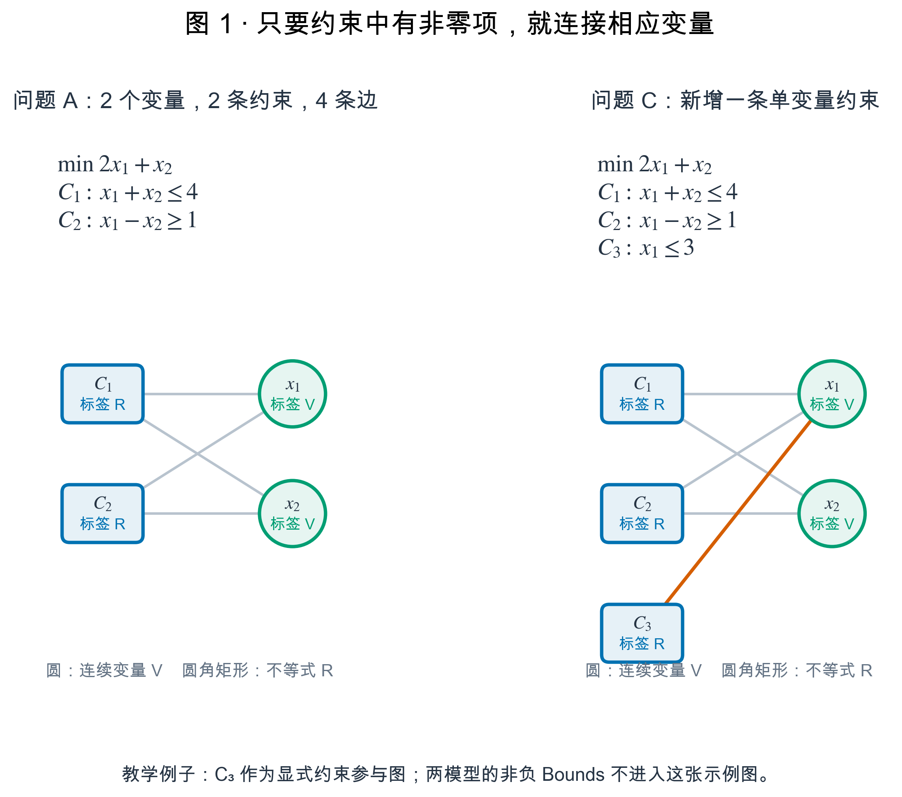
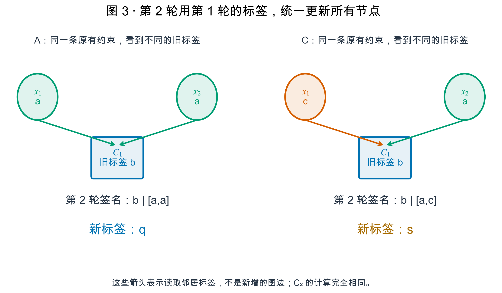
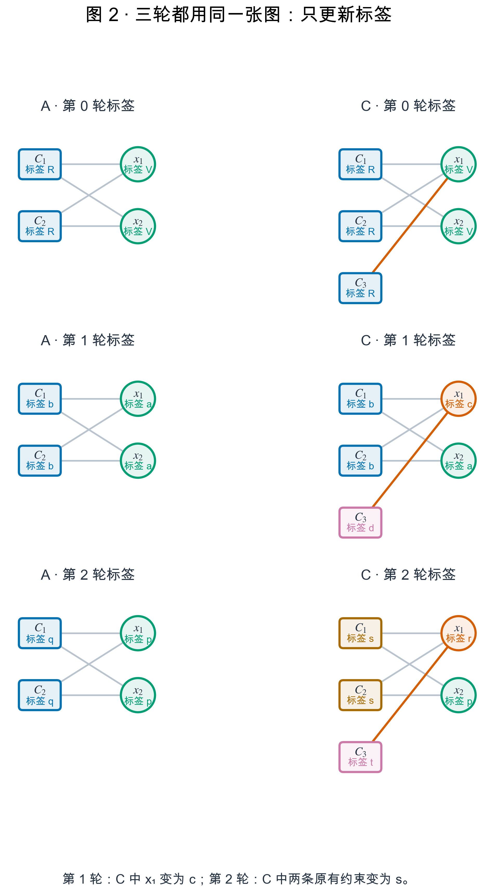
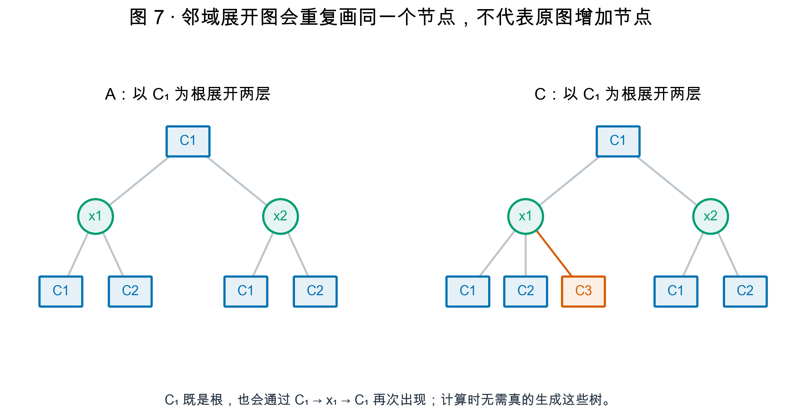
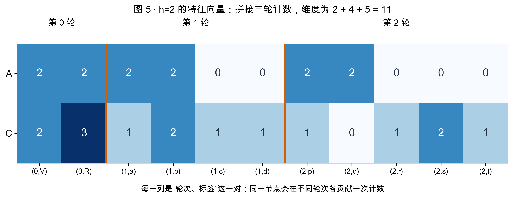
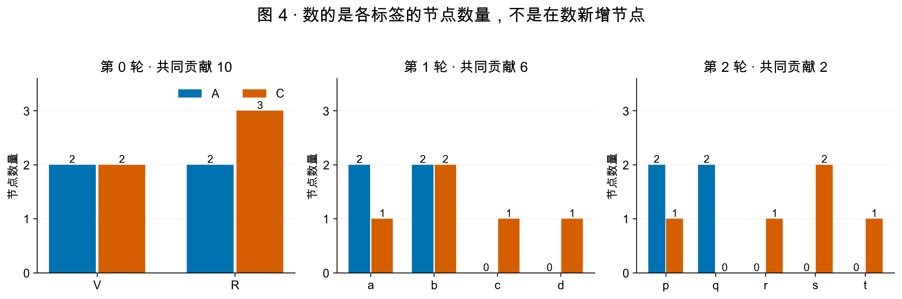
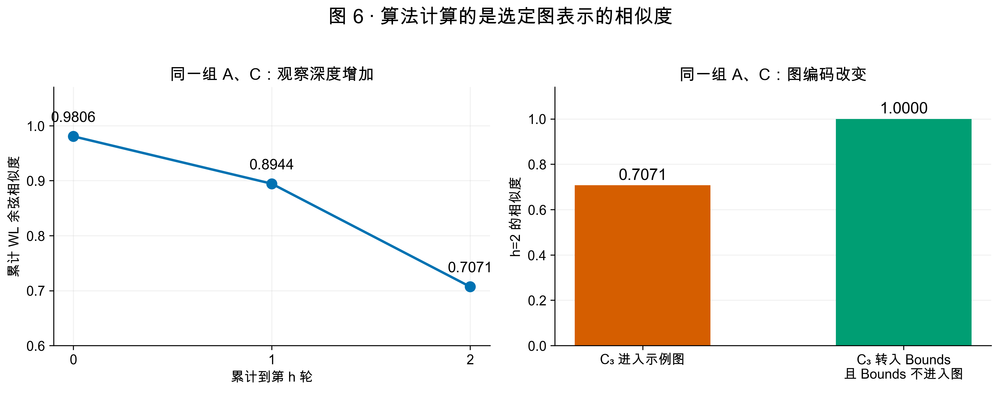

# WL 结构相似度：从两个 LP 开始，逐符号、逐公式计算

这份讲稿面向刚接触图论和优化的大二学生。不需要先懂图神经网络，也不需要先读 WL 论文。我们一直使用同一对模型 A、C，把每一轮每一个节点的标签都算出来。

请先记住一句话：**WL 不改变图的节点和边；它反复更新节点标签，再比较标签的数量。**

## 阅读顺序与本例的边界处理

先看第 1—3 节，认识图和初始标签；再看第 4—8 节，手算第 1、2 轮；最后看第 9—13 节，理解累计相似度、实际代码和 Bounds 的影响。

**为完整复现前面讨论的 0.8944 和 0.7071，教学例子让 C 的新增行 `x1 <= 3` 作为约束节点进入图，而两模型原有的非负 Bounds 不进入图。** 这是一个明确规定的示例图，不是把所有原生上下界都纳入的规范化版本。第 12 节会单独说明：按照我们最新的“所有单变量限制转入 Bounds 并排除”规则，本例的相似度反而变成 1。

文中 $G=(V,E,\ell)$、$N(v)$、$l_i$、$M_i$、$s_i$、$f$、$\Sigma_i$、$c_i$、$\phi_{\mathrm{WLsubtree}}^{(h)}$ 沿用 WL 论文的符号体系。字母 `a,b,c,d,p,q,r,s,t` 是为本例取的标签代号；`K_i` 是本文为“单轮贡献”增加的简称；$S_h$ 是我们额外使用的余弦归一化分数。不能把 LP 图编码和归一化规则说成原论文对优化模型规定的标准。

## 1. 先确定我们要比较哪两个数学模型

### 1.1 模型 A

$$
\begin{aligned}
\min\quad &2x_1+x_2\\
C_1:\quad &x_1+x_2\leq4,\\
C_2:\quad &x_1-x_2\geq1,\\
&x_1,x_2\geq0,\qquad x_1,x_2\text{ 为连续变量。}
\end{aligned}
$$

这里 $x_1,x_2$ 是需要求解的两个变量；$C_1,C_2$ 是两条约束的名称。约束名中的 $C$ 与后面“模型 C”的名字没有数学关系。

例如，把 $x_1=2,x_2=1$ 代入：第一条约束左边为 $2+1=3\leq4$，第二条为 $2-1=1\geq1$，因此这是 A 的一个可行解。目标值为 $2\times2+1=5$。

### 1.2 模型 C

C 保留 A 的目标和两条原有约束，额外增加一条上界约束：

$$
\begin{aligned}
\min\quad &2x_1+x_2\\
C_1:\quad &x_1+x_2\leq4,\\
C_2:\quad &x_1-x_2\geq1,\\
C_3:\quad &x_1\leq3,\\
&x_1,x_2\geq0,\qquad x_1,x_2\text{ 为连续变量。}
\end{aligned}
$$

同一个解 $x_1=2,x_2=1$ 满足新增的 $2\leq3$，所以也是 C 的可行解。

但二者并非完全相同。例如 $x_1=3.5,x_2=0.5$ 在 A 中满足 $3.5+0.5=4\leq4$、$3.5-0.5=3\geq1$，却在 C 中违反 $3.5\leq3$。这说明新增行确实可以改变可行域。

在两个模型里都写 $x_1,x_2$，只是为了便于对应。它们是两张图里的不同节点，不能把它们合并成同一张图中的共享变量。

## 2. 从数学模型变成“变量—约束”二部图

### 2.1 第一个符号：$G=(V,E,\ell)$

这是一个带标签图的写法：

- $G$：整张图；
- $V$：图中所有节点的集合；
- $E$：图中所有边的集合；
- $\ell$：给每个节点指定初始标签的函数。

这里的集合 $V$ 与后面的标签字符串 `V` 是两件事。集合包含节点；字符串只是某一类节点的名字。

**对应的完整例子：** 用 $G$ 表示 A 的图，用 $G'$ 表示 C 的图，撇号 $ '$ 只是“另一个图”的记号。

$$
V_A=\{x_1^A,x_2^A,C_1^A,C_2^A\},
\qquad
V_C=\{x_1^C,x_2^C,C_1^C,C_2^C,C_3^C\}.
$$

上标 A、C 仅说明节点属于哪个模型。例如 $x_1^A$ 是 A 中的第一个变量。为了让后面的表更好读，我们会用表格的“模型”列区分它们，省略上标。

### 2.2 为什么叫二部图

节点分成两类：变量节点与约束节点。边只能连接这两类节点。

- 变量不直接连接变量；
- 约束不直接连接约束；
- 一条约束包含某个变量的非零项，就在二者之间画一条边。

例如，A 中 $C_1:x_1+x_2\leq4$ 同时包含 $x_1,x_2$，所以有两条边。$C_2:x_1-x_2\geq1$ 也有两条边：负系数 (-1) 仍然是非零系数，因此仍然产生边。

**两张图的完整边集合：**

$$
E_A=\{(C_1^A,x_1^A),(C_1^A,x_2^A),(C_2^A,x_1^A),(C_2^A,x_2^A)\}.
$$

$$
E_C=\{(C_1^C,x_1^C),(C_1^C,x_2^C),(C_2^C,x_1^C),(C_2^C,x_2^C),(C_3^C,x_1^C)\}.
$$

A 有 4 个节点、4 条边；C 有 5 个节点、5 条边。C 的新增行只连接 $x_1$，不连接 $x_2$。边是无向的：写 $(C_1,x_1)$ 与写 $(x_1,C_1)$ 指的是同一条边，不重复计算。



图中的连线交叉处如果没有画节点，就不是新的节点。

### 2.3 第二个符号：$N(v)$，节点的邻居

$v$ 是“当前关注的某一个节点”，不是专指变量。它可以是 $x_1$，也可以是 $C_1$。

$$
N(v)=\{u:(v,u)\in E\}.
$$

$u$ 表示与 $v$ 直接连边的节点；$\in$ 表示“属于”。因此，这个公式的意思是：把所有直接连接 $v$ 的节点列出来。

**完整例子：两张图中每一个节点的邻居都列在这里。**

| 模型 | 当前节点 $v$ | 邻居 $N(v)$ | 邻居数量 |
|---|---|---|---:|
| A | $x_1$ | $\{C_1,C_2\}$ | 2 |
| A | $x_2$ | $\{C_1,C_2\}$ | 2 |
| A | $C_1$ | $\{x_1,x_2\}$ | 2 |
| A | $C_2$ | $\{x_1,x_2\}$ | 2 |
| C | $x_1$ | $\{C_1,C_2,C_3\}$ | 3 |
| C | $x_2$ | $\{C_1,C_2\}$ | 2 |
| C | $C_1$ | $\{x_1,x_2\}$ | 2 |
| C | $C_2$ | $\{x_1,x_2\}$ | 2 |
| C | $C_3$ | $\{x_1\}$ | 1 |

后面的全部计算，都可以从这张邻居表开始复核。

## 3. 第 0 轮：只给节点分类型，还没有读取邻居

### 3.1 第三个符号：$l_0(v)=\ell(v)$

小写 $l_i(v)$ 表示节点 $v$ 在第 $i$ 轮的标签。下标 $i$ 是轮次，不是节点编号。

$$
l_0(v)=\ell(v).
$$

公式表示：第 0 轮标签，就是建图时指定的初始标签。

**本例的完整赋值：**

- 所有连续变量都给标签 `V`，实际代码里对应 `V:C`；
- 所有不等式都给标签 `R`，实际代码里对应 `R:I`；
- 本例没有等式、整数变量或二元变量，所以暂时没有其他初始类型。

| 模型 | 节点 | $l_0(v)$ |
|---|---|---|
| A | $x_1$ | V |
| A | $x_2$ | V |
| A | $C_1$ | R |
| A | $C_2$ | R |
| C | $x_1$ | V |
| C | $x_2$ | V |
| C | $C_1$ | R |
| C | $C_2$ | R |
| C | $C_3$ | R |

注意：$\leq$ 与 $\geq$ 在本实现里都属于不等式标签 R。系数正负、系数大小、右端项和目标系数不放进标签。

### 3.2 第四个符号：$\Sigma_i$，这一轮出现过哪些标签

$\Sigma_i$ 是第 $i$ 轮在两张图中出现过的标签集合。希腊字母 $\Sigma$ 在这里表示一个集合，不是“求和符号” $\sum$。

**第 0 轮的完整例子：** 两张图都只有 V 与 R 两种标签，所以

$$
\Sigma_0=\{\mathrm V,\mathrm R\}.
$$

按 V、R 这个顺序，A 的计数是 $(2,2)$，C 的计数是 $(2,3)$。

### 3.3 第五个符号：$c_i(G,\sigma)$，某标签有多少个节点

$\sigma$ 表示某一种标签，例如 V、R，或者后面的 a、b。$c_i$ 中的字母 c 表示“计数函数”，不是模型 C。

$$
c_i(G,\sigma)=\big|\{v\in V:l_i(v)=\sigma\}\big|.
$$

两侧的竖线 $|\cdot|$ 表示集合中有多少个元素。公式的意思是：在图 G 中，找出第 i 轮标签等于 $\sigma$ 的节点，数一数数量。

**完整例子：**

$$
c_0(G,\mathrm V)=|\{x_1^A,x_2^A\}|=2,
\qquad
c_0(G,\mathrm R)=|\{C_1^A,C_2^A\}|=2.
$$

$$
c_0(G',\mathrm V)=|\{x_1^C,x_2^C\}|=2,
\qquad
c_0(G',\mathrm R)=|\{C_1^C,C_2^C,C_3^C\}|=3.
$$

### 3.4 第六个符号：$K_i(G,G')$，这一轮的共同贡献

这是讲稿增加的简称。它表示：同一种标签在两张图中的数量相乘，再对所有标签求和。

$$
K_i(G,G')=\sum_{\sigma\in\Sigma_i}c_i(G,\sigma)c_i(G',\sigma).
$$

这里 $\sum$ 表示“把后面的各项加起来”。

**完整计算：第 0 轮只有 V、R 两项。**

$$
K_0(G,G')=2\times2+2\times3=4+6=10.
$$

| 标签 | A 中数量 | C 中数量 | 对共同贡献的作用 |
|---|---:|---:|---:|
| V | 2 | 2 | $2\times2=4$ |
| R | 2 | 3 | $2\times3=6$ |
| 合计 | 4 个节点 | 5 个节点 | 10 |

**为什么贡献 10，大于两张图的节点数？** 因为它不是一一配对。A 的两个 V 可以分别与 C 的两个 V 形成 $2\times2=4$ 个同标签节点对。A 的两个 R 可以与 C 的三个 R 形成 $2\times3=6$ 个节点对。比较完这些节点对，不会在图中增加任何节点或边。

### 3.5 同一个公式还可以计算“自身贡献”

把第二张图换成第一张图自身，就把每个计数平方：

$$
K_i(G,G)=\sum_{\sigma\in\Sigma_i}c_i(G,\sigma)^2.
$$

**完整计算：**

$$
K_0(G,G)=2^2+2^2=8,
\qquad
K_0(G',G')=2^2+3^2=13.
$$

这是后面归一化分母的组成部分，不表示“多产生了 8 个、13 个节点”。

## 4. 更新标签的规则：一次只读取上一轮的结果

接下来的三个符号，定义了每一轮到底在做什么。先用 A 的 $x_1$ 完整算一遍，再对所有节点重复。

### 4.1 第七个符号：$M_i(v)$，邻居旧标签的多重集

对于第 1 轮及之后：

$$
M_i(v)=\{\!\{l_{i-1}(u):u\in N(v)\}\!\}.
$$

“多重集”允许同一个标签出现多次。此处双花括号强调保留重复标签。原论文也用 multiset 表达这一点。

**完整例子：A 中 $x_1$ 的第 1 轮。**

1. 当前节点 $v=x_1^A$。
2. 它的邻居是 $N(x_1^A)=\{C_1^A,C_2^A\}$。
3. 两个邻居第 0 轮的标签分别是 R、R。
4. 所以

$$
M_1(x_1^A)=\{\!\{\mathrm R,\mathrm R\}\!\}.
$$

而 C 中的对应节点有三个邻居：

$$
M_1(x_1^C)=\{\!\{\mathrm R,\mathrm R,\mathrm R\}\!\}.
$$

**不能把它们都简化成集合 $\{\mathrm R\}$。** 那样会丢掉“两个邻居”与“三个邻居”的区别。也不能把 R 的代号数值加起来：标签是类别，不是可相加的分数。

### 4.2 第八个符号：$s_i(v)$，把自己和邻居拼成签名

$$
s_i(v)=\operatorname{concat}\big(l_{i-1}(v),\operatorname{sort}(M_i(v))\big).
$$

这里 `sort` 表示排序，`concat` 表示拼接。讲稿中用 `自己的旧标签 | [排序后的邻居旧标签]` 展示签名。

**完整例子：**

$$
s_1(x_1^A)=\mathrm V\,|\,[\mathrm R,\mathrm R],
\qquad
s_1(x_1^C)=\mathrm V\,|\,[\mathrm R,\mathrm R,\mathrm R].
$$

签名左边的 V 说明当前节点自己是变量；右边列表说明它连接了哪些类型的邻居、各有多少个。

排序只是为了不受邻居枚举顺序影响。例如第 2 轮读到列表 `[c,a]`，排序后是 `[a,c]`；另一个节点读到 `[a,c]`，排序后仍是 `[a,c]`，于是二者不会仅因读取顺序不同而被判成不同。

代码中用元组保存签名。例如 `('V', ('R', 'R'))`，而不是随意把字符粘在一起。这样不会因省略分隔符把两个不同列表误认为相同。

### 4.3 第九个符号：$f$，共享的标签压缩映射

$$
l_i(v)=f(s_i(v)).
$$

$f$ 只是一个字典：把很长的签名换成较短的标签代号。

**本例第 1 轮的完整字典：**

| 签名 | 新标签 | 通俗含义 |
|---|---|---|
| `V \| [R,R]` | a | 连续变量，连接两条不等式 |
| `R \| [V,V]` | b | 不等式，连接两个连续变量 |
| `V \| [R,R,R]` | c | 连续变量，连接三条不等式 |
| `R \| [V]` | d | 不等式，连接一个连续变量 |

例如 A 的 $x_1$ 与 C 的 $x_2$ 都具有 `V | [R,R]`，所以都得到 a。C 的 $x_1$ 有三个 R，得到不同的 c。

这一映射必须满足：

$$
f(s)=f(t)\quad\Longleftrightarrow\quad s=t.
$$

$s,t$ 是两个签名；$\Longleftrightarrow$ 表示“当且仅当”。完整例子是：`V | [R,R]` 与自身相同，所以两次查字典都得到 a；它与 `V | [R,R,R]` 不同，所以不能也给 a。

**两张图必须共享同一本字典。** 不能各自把“遇到的第一个签名”编码成 1 后，就认为两个 1 的含义相同。本例中字典不仅共享，而且不同签名不会因为普通哈希值偶然相同就合并：Python 字典还会检查完整键是否相等。

代号 a、b、c 没有大小或距离意义。a 与 b 不是“相差 1”，也不是“比 a 更大”。字典把代号换成任意不同的整数，最终相似度也不会改变。

## 5. 第 1 轮：把两张图的所有节点完整更新一次

现在对 A 的 4 个节点、C 的 5 个节点执行同样的规则：读旧标签，列邻居旧标签，拼签名，查共享字典。

| 模型 | 节点 | 自己的旧标签 $l_0$ | 邻居旧标签 $M_1$ | 签名 $s_1$ | 新标签 $l_1$ |
|---|---|---|---|---|---|
| A | $x_1$ | V | [R,R] | `V \| [R,R]` | a |
| A | $x_2$ | V | [R,R] | `V \| [R,R]` | a |
| A | $C_1$ | R | [V,V] | `R \| [V,V]` | b |
| A | $C_2$ | R | [V,V] | `R \| [V,V]` | b |
| C | $x_1$ | V | [R,R,R] | `V \| [R,R,R]` | c |
| C | $x_2$ | V | [R,R] | `V \| [R,R]` | a |
| C | $C_1$ | R | [V,V] | `R \| [V,V]` | b |
| C | $C_2$ | R | [V,V] | `R \| [V,V]` | b |
| C | $C_3$ | R | [V] | `R \| [V]` | d |

**为什么第 1 轮 C 的 $C_1,C_2$ 还与 A 相同？** 它们读取的是变量的第 0 轮标签。虽然 $x_1$ 在这一轮将变成 c，但第 0 轮它还是 V；所以两条约束当前仍然看到 `[V,V]`。

一轮更新必须同时完成：先把所有旧标签固定下来，算出所有新标签，最后一起替换。不能刚把 $x_1$ 更新为 c，就让本轮 $C_1$ 读取这个新 c；那会使结果依赖处理节点的顺序，与这里实现的 WL 不同。

### 第 1 轮的全部计数和贡献

这一轮出现的标签集合为

$$
\Sigma_1=\{a,b,c,d\}.
$$

| 标签 | A 中数量 | C 中数量 | 共同贡献 |
|---|---:|---:|---:|
| a | 2 | 1 | $2\times1=2$ |
| b | 2 | 2 | $2\times2=4$ |
| c | 0 | 1 | $0\times1=0$ |
| d | 0 | 1 | $0\times1=0$ |

按 a、b、c、d 排列，计数分别是 A：$(2,2,0,0)$，C：$(1,2,1,1)$。

$$
K_1(G,G')=2\times1+2\times2+0\times1+0\times1=6.
$$

$$
K_1(G,G)=2^2+2^2+0^2+0^2=8,
\qquad
K_1(G',G')=1^2+2^2+1^2+1^2=7.
$$

请核对节点总数：A 的标签计数加起来仍是 4，C 仍是 5。新标签种类变多，不代表新节点变多。

## 6. 第 2 轮：逐个看清差异到底怎样传播

### 6.1 先完整列出第 2 轮的共享字典

这一轮读取的是第 1 轮的 a、b、c、d，而不再直接读取初始 V、R。

| 第 2 轮签名 | 新标签 | 解释 |
|---|---|---|
| `a \| [b,b]` | p | 自己上轮是 a，两个邻居上轮都是 b |
| `b \| [a,a]` | q | 自己上轮是 b，两个邻居上轮都是 a |
| `c \| [b,b,d]` | r | 自己上轮是 c，邻居上轮为 b、b、d |
| `b \| [a,c]` | s | 自己上轮是 b，邻居上轮为 a、c |
| `d \| [c]` | t | 自己上轮是 d，唯一邻居上轮是 c |

这些 p、q、r、s、t 是新的标签代号，不是新的变量或新的约束。

### 6.2 先算 A 的每一个节点

**A 的 $x_1$：** 自己的第 1 轮标签是 a；邻居 $C_1,C_2$ 的第 1 轮标签都是 b。因此

$$
M_2(x_1^A)=[b,b],\qquad
s_2(x_1^A)=a\,|\,[b,b],\qquad
l_2(x_1^A)=p.
$$

A 的 $x_2$ 有相同计算，也得到 p。

**A 的 $C_1$：** 自己第 1 轮是 b；两个邻居 $x_1,x_2$ 第 1 轮都是 a。因此

$$
M_2(C_1^A)=[a,a],\qquad
s_2(C_1^A)=b\,|\,[a,a],\qquad
l_2(C_1^A)=q.
$$

A 的 $C_2$ 有相同计算，也得到 q。

### 6.3 再算 C 的每一个节点

**C 的 $x_1$：** 自己第 1 轮是 c；三个约束邻居分别为 b、b、d。因此

$$
M_2(x_1^C)=[b,b,d],\qquad
s_2(x_1^C)=c\,|\,[b,b,d],\qquad
l_2(x_1^C)=r.
$$

**C 的 $x_2$：** 自己第 1 轮是 a；两个邻居 $C_1,C_2$ 的第 1 轮仍都是 b。因此

$$
M_2(x_2^C)=[b,b],\qquad
s_2(x_2^C)=a\,|\,[b,b],\qquad
l_2(x_2^C)=p.
$$

**所以 C 的 $x_2$ 在第 2 轮仍与 A 的变量匹配。** 它不能提前读取本轮刚算出来的 s。

**C 的 $C_1$：** 自己第 1 轮是 b；两个邻居中，$x_1$ 第 1 轮是 c，$x_2$ 第 1 轮是 a。排序后是 `[a,c]`。因此

$$
M_2(C_1^C)=[a,c],\qquad
s_2(C_1^C)=b\,|\,[a,c],\qquad
l_2(C_1^C)=s.
$$

C 的 $C_2$ 也看到 `[a,c]`，因此同样得到 s。

**这就是“差异传播到原来的两条约束”的含义。** 约束方程没变，邻居集合也没变；变的是其中一个邻居的旧标签。签名发生变化，所以新标签发生变化。

**C 的 $C_3$：** 自己第 1 轮是 d；唯一邻居 $x_1$ 第 1 轮是 c。因此

$$
M_2(C_3^C)=[c],\qquad
s_2(C_3^C)=d\,|\,[c],\qquad
l_2(C_3^C)=t.
$$



图中的箭头表示“读取邻居的旧标签”，不是在二部图里新建有向边。二部图原本的边仍是无向边。

### 6.4 第 2 轮的完整逐节点表

| 模型 | 节点 | 自己旧标签 $l_1$ | 邻居旧标签 $M_2$ | 签名 $s_2$ | 新标签 $l_2$ |
|---|---|---|---|---|---|
| A | $x_1$ | a | [b,b] | `a \| [b,b]` | p |
| A | $x_2$ | a | [b,b] | `a \| [b,b]` | p |
| A | $C_1$ | b | [a,a] | `b \| [a,a]` | q |
| A | $C_2$ | b | [a,a] | `b \| [a,a]` | q |
| C | $x_1$ | c | [b,b,d] | `c \| [b,b,d]` | r |
| C | $x_2$ | a | [b,b] | `a \| [b,b]` | p |
| C | $C_1$ | b | [a,c] | `b \| [a,c]` | s |
| C | $C_2$ | b | [a,c] | `b \| [a,c]` | s |
| C | $C_3$ | d | [c] | `d \| [c]` | t |

### 6.5 第 2 轮的完整计数和贡献

这一轮的标签集合为

$$
\Sigma_2=\{p,q,r,s,t\}.
$$

| 标签 | A 中数量 | C 中数量 | 共同贡献 |
|---|---:|---:|---:|
| p | 2 | 1 | $2\times1=2$ |
| q | 2 | 0 | $2\times0=0$ |
| r | 0 | 1 | $0\times1=0$ |
| s | 0 | 2 | $0\times2=0$ |
| t | 0 | 1 | $0\times1=0$ |

按 p、q、r、s、t 排列，计数分别为 A：$(2,2,0,0,0)$，C：$(1,0,1,2,1)$。

$$
K_2(G,G')=2\times1+2\times0+0\times1+0\times2+0\times1=2.
$$

$$
K_2(G,G)=2^2+2^2+0^2+0^2+0^2=8,
$$

$$
K_2(G',G')=1^2+0^2+1^2+2^2+1^2=7.
$$

标签计数的和仍是 A：4，C：5。整个过程中，A 的 4 条边、C 的 5 条边也一直没有改变。

## 7. 把三轮放在一起看：新标签不是新节点



图中每个圆始终代表原来那个变量，每个圆角矩形始终代表原来那条约束。变化的只是节点内部“标签”一行。

对照 C 中的 $x_1$：第 0 轮标签 V，第 1 轮标签 c，第 2 轮标签 r。不是依次创建了 V、c、r 三个变量。

### 第十个符号：$G_i=(V,E,l_i)$

这是“第 i 轮更新完标签后的图”的记号。

**完整例子：A 的图在三轮里分别是**

$$
G_0=(V_A,E_A,l_0),\qquad
G_1=(V_A,E_A,l_1),\qquad
G_2=(V_A,E_A,l_2).
$$

若按 $x_1,x_2,C_1,C_2$ 的顺序读节点，三轮的标签列表是：

```text
G0: V, V, R, R
G1: a, a, b, b
G2: p, p, q, q
```

三个表达式中，节点集合和边集合完全相同，只有标签函数从 $l_0$ 换为 $l_1$、再换为 $l_2$。

### 为什么二部图也能传播两轮信息

二部图规定的是边的两端类型，不是算法最多能更新几轮。差异可以沿着已有的边走：

```text
新增约束 C3 → 变量 x1 → 原来的约束 C1、C2
```

这条路径一直交替经过“约束—变量—约束”，符合二部图规则。没有新增约束—约束的直接边。

### 为什么有些论文图会重复画一个节点

为了展示两层邻域，可以把图临时“展开”成一个计算示意树。例如，以 $C_1$ 为根，第一层有 $x_1,x_2$；第二层列出这两个变量各自的约束邻居。



在 A 中，经由路径 $C_1\to x_1\to C_1$，根节点 $C_1$ 会在第二层再次出现；经由 $x_2$ 也会再出现。**这些是同一原节点的重复展示，不是原图新增了约束。** C 中多了一条 $x_1\to C_3$ 路径，因此其展开视图多一个叶子。

实际代码不生成这些树，只保存上一轮标签，并读取原图上的邻居列表。

## 8. 第十一组符号：$h$、特征向量 $\phi^{(h)}$ 与累计核

### 8.1 $h$ 是最后一轮编号

本例 $h=2$，表示更新两次，并且把第 0、1、2 轮的计数全部保留，一共三组计数。

不是只保留第 2 轮，也不是做“二维 WL”。我们用的仍然是 1-WL；2 是迭代深度。

### 8.2 $\phi_{\mathrm{WLsubtree}}^{(h)}(G)$ 是拼接后的计数向量

$\phi$ 读作 phi，表示“把图变成数字向量的映射”。上标 $h$ 表示累计到第几轮；下标说明使用 WL subtree 特征。

$$
\phi_{\mathrm{WLsubtree}}^{(h)}(G)
=\big(c_0(G,\sigma_{01}),\ldots,c_0(G,\sigma_{0|\Sigma_0|}),
\ldots,c_h(G,\sigma_{h1}),\ldots,c_h(G,\sigma_{h|\Sigma_h|})\big).
$$

这里 $\sigma_{ij}$ 表示“第 i 轮标签表中的第 j 个标签”；

- 本例第 0 轮：$\sigma_{01}=\mathrm V,\sigma_{02}=\mathrm R$，一共 $|\Sigma_0|=2$ 种；
- 第 1 轮：按 a、b、c、d 排列，一共 $|\Sigma_1|=4$ 种；
- 第 2 轮：按 p、q、r、s、t 排列，一共 $|\Sigma_2|=5$ 种。

竖线 $|\Sigma_i|$ 仍然表示集合大小，省略号 $\ldots$ 表示按标签顺序继续写出其余计数。

**把这个看起来很长的公式在本例里完全展开：**

$$
\phi_{\mathrm{WLsubtree}}^{(2)}(G)
=(\underbrace{2,2}_{\text{第0轮}}\;;\;
\underbrace{2,2,0,0}_{\text{第1轮}}\;;\;
\underbrace{2,2,0,0,0}_{\text{第2轮}}).
$$

$$
\phi_{\mathrm{WLsubtree}}^{(2)}(G')
=(\underbrace{2,3}_{\text{第0轮}}\;;\;
\underbrace{1,2,1,1}_{\text{第1轮}}\;;\;
\underbrace{1,0,1,2,1}_{\text{第2轮}}).
$$

分号只是为了让人看清轮次分组，真正的向量有 $2+4+5=11$ 个数字。



图中每一列的名字是“轮次、标签”，例如 `(1,a)`。代码也保留轮次：即使不同轮都把某个标签临时编码为整数 1，也不会把两轮的计数错误地合并。

**同一个节点会在不同轮次各贡献一次计数。** 所以 A 的向量所有数字加起来是 $4+4+4=12$，不是 12 个节点；它表示 4 个节点在 3 个观察深度下共提供 12 次计数。

### 8.3 $k_{\mathrm{WLsubtree}}^{(h)}$：两个特征向量的内积

$$
k_{\mathrm{WLsubtree}}^{(h)}(G,G')
=\left\langle\phi_{\mathrm{WLsubtree}}^{(h)}(G),
\phi_{\mathrm{WLsubtree}}^{(h)}(G')\right\rangle
=\sum_{i=0}^{h}K_i(G,G').
$$

尖括号 $\langle\cdot,\cdot\rangle$ 表示内积：对应位置相乘，再全部相加。`kernel` 在这里就是这个核函数，不需要先学习其他机器学习算法。

**完整计算：$h=2$ 时，有 11 项对应位置乘积。**

$$
\begin{aligned}
k_{\mathrm{WLsubtree}}^{(2)}(G,G')
={}&2\times2+2\times3\\
&+2\times1+2\times2+0\times1+0\times1\\
&+2\times1+2\times0+0\times1+0\times2+0\times1\\
={}&10+6+2=18.
\end{aligned}
$$

同样，两个累计自身核为

$$
k_{\mathrm{WLsubtree}}^{(2)}(G,G)=8+8+8=24,
\qquad
k_{\mathrm{WLsubtree}}^{(2)}(G',G')=13+7+7=27.
$$

第 0 轮与第 1 轮的数字没有覆盖掉，它们都留在累计向量里。

## 9. 第十二个符号：$S_h$，归一化成 0—1 的相似度

原始内积受到计数大小影响。我们用下面的余弦归一化得到分数：

$$
S_h(G,G')=
\frac{k_{\mathrm{WLsubtree}}^{(h)}(G,G')}
{\sqrt{k_{\mathrm{WLsubtree}}^{(h)}(G,G)
k_{\mathrm{WLsubtree}}^{(h)}(G',G')}}.
$$

根号中的两个自身核分别来自两张图。对于这里的非负计数向量，分数在 0 与 1 之间。它表示特征向量方向有多接近，不是“相同约束的百分比”。

### 9.1 只累计到第 0 轮

$$
S_0(G,G')=\frac{10}{\sqrt{8\times13}}
=\frac{10}{\sqrt{104}}
\approx\frac{10}{10.1980}=0.9806.
$$

此时仅比较“有多少变量、多少不等式”，还没有读取任何邻居。两图的类型数量接近，因此分数很高。

### 9.2 累计到第 1 轮

$$
S_1(G,G')=
\frac{10+6}{\sqrt{(8+8)(13+7)}}
=\frac{16}{\sqrt{16\times20}}
=\frac{16}{\sqrt{320}}
\approx\frac{16}{17.8885}=0.8944.
$$

这就是前面讨论的 0.8944。共同贡献已经包含了第 0 轮的 10 和第 1 轮的 6。

### 9.3 累计到第 2 轮

$$
S_2(G,G')=
\frac{10+6+2}{\sqrt{(8+8+8)(13+7+7)}}
=\frac{18}{\sqrt{24\times27}}
=\frac{18}{\sqrt{648}}
\approx\frac{18}{25.4558}=0.7071.
$$

这就是前面讨论的 0.7071。第 2 轮让两条原有约束也出现了不同标签，单轮共同贡献降到 2，但旧轮次的贡献仍然保留。

### 9.4 不要把“单轮贡献”与“累计相似度”混在一起

| 最后一轮编号 | 本轮共同贡献 | 本轮 A 自身贡献 | 本轮 C 自身贡献 | 累计共同贡献 | 累计 A 自身核 | 累计 C 自身核 | 累计相似度 |
|---:|---:|---:|---:|---:|---:|---:|---:|
| 0 | 10 | 8 | 13 | 10 | 8 | 13 | 0.9806 |
| 1 | 6 | 8 | 7 | 16 | 16 | 20 | 0.8944 |
| 2 | 2 | 8 | 7 | 18 | 24 | 27 | 0.7071 |

如果你只拿第 2 轮的数字算 $2/\sqrt{8\times7}=0.2673$，算到的是“仅这一轮计数向量的余弦”，不是这里的累计 WL 相似度 $S_2$。



本例的分数随深度降低，但不要据此认为所有模型对的分数都必然单调降低。累计余弦同时改变分子与分母，需要实际计算。

## 10. 把公式对应到可运行的代码

下面代码只依赖 Python 标准库，复制后即可运行本例。它采用与项目实现一致的规则：共享字典、保留重复邻居标签、同步更新、累计各轮计数、余弦归一化。

```python
from collections import Counter
from math import sqrt, isclose


def make_graph(variable_types, rows):
    """rows 中每项为 (约束类型, 出现非零项的变量下标列表)。"""
    n = len(variable_types)
    labels = [f"V:{t}" for t in variable_types]
    labels += [f"R:{row_type}" for row_type, _ in rows]
    neighbors = [[] for _ in labels]
    for i, (_, variable_indices) in enumerate(rows):
        row_node = n + i
        for j in variable_indices:
            neighbors[row_node].append(j)
            neighbors[j].append(row_node)
    return labels, neighbors


def wl_features(graphs, h):
    # l0：复制初始标签。每张图有自己的标签列表。
    labels = [initial[:] for initial, _ in graphs]
    features = [Counter() for _ in graphs]

    for i in range(h + 1):
        # ci：数当前轮各标签数量。
        # phi：把“轮次、标签”作为特征键，保留所有旧轮次计数。
        for graph_index, current in enumerate(labels):
            features[graph_index].update((i, label) for label in current)

        if i == h:
            break

        codebook = {}                 # 这一轮所有图共享的 f
        next_labels_all_graphs = []

        for current, (_, neighbors) in zip(labels, graphs):
            next_labels = []
            for v, adjacent_nodes in enumerate(neighbors):
                # Mi：读取上一轮邻居标签，保留重复项。
                neighbor_labels = tuple(sorted(current[u] for u in adjacent_nodes))
                # si：自己的旧标签 + 排序后的邻居旧标签。
                signature = (current[v], neighbor_labels)
                if signature not in codebook:
                    codebook[signature] = len(codebook)
                # li = f(si)。这里用整数代号，作用与讲稿中字母相同。
                next_labels.append(codebook[signature])
            next_labels_all_graphs.append(next_labels)

        # 所有节点的新标签都算完之后，再统一替换旧标签。
        labels = next_labels_all_graphs

    return features


def similarity(left, right):
    # 对应位置相乘相加：累计 WL 内积。
    cross = sum(count * right.get(key, 0) for key, count in left.items())
    self_left = sum(count * count for count in left.values())
    self_right = sum(count * count for count in right.values())
    if self_left == 0 or self_right == 0:
        raise ValueError("空图不能做这里的余弦归一化")
    return cross / sqrt(self_left * self_right)


# C 表示 continuous；I 表示 inequality。二者属于不同标签命名空间。
graph_A = make_graph(["C", "C"], [("I", [0, 1]), ("I", [0, 1])])
graph_C = make_graph(["C", "C"], [("I", [0, 1]), ("I", [0, 1]), ("I", [0])])

expected = [0.9805806756909202, 0.8944271909999159, 0.7071067811865476]
for h in range(3):
    feature_A, feature_C = wl_features([graph_A, graph_C], h)
    score = similarity(feature_A, feature_C)
    assert isclose(score, expected[h], rel_tol=0, abs_tol=1e-12)
    print(f"h={h}, similarity={score:.4f}")
```

完整输出：

```text
h=0, similarity=0.9806
h=1, similarity=0.8944
h=2, similarity=0.7071
```

代码里的 `n` 只是变量数量：本例 n=2，所以前两个节点下标 0、1 是变量。约束下标从 2 开始。A 的 C1、C2 是节点 2、3；C 的新增 C3 是节点 4。

`[0,1]` 表示约束包含第一个、第二个变量，并不是要求变量取值 0 和 1。`Counter` 是计数字典，不是模型求解器。整数标签是类别代号，不是计数。

### 与当前 LP 实现的对应关系

实际项目的 `wl_bipartite.py` 先用求解器读取 LP，取出约束矩阵的非零位置、变量类型和约束类型，再构造同样的邻居列表。它用稀疏矩阵批量计算计数向量的内积；上面的代码用计数字典逐项计算。本例已同时用二者核对，结果相同。

例如 A 的两行系数是 `[1,1]`、`[1,-1]`。两行的非零下标都是 `[0,1]`，因此得到代码中的两条 `("I", [0,1])`。C 的新增行系数是 `[1,0]`，非零下标为 `[0]`，因此得到 `("I", [0])`。

## 11. 用 WL 计算“最近参考”时还需要哪一步

WL 给出的是“一张测试图与一张参考图”的分数。表格里的“同类别最近参考”需要再做一次取最大值。

### 第十三组符号：$P$、$R_g$、$S_g(P)$

$P$ 是一个测试问题；$g$ 是它的类别；$R_g$ 是属于该类别的参考问题集合。令 $G_P,G_r$ 分别为测试问题 P 和参考问题 r 的图。

$$
S_g(P)=\max_{r\in R_g}S_2(G_P,G_r).
$$

$\max$ 表示“取最大的数”。完整示例：假设 P 是 Mixture 问题，同类别参考只有 r1、r2，两者分数分别为 0.40、0.70，那么

$$
S_g(P)=\max(0.40,0.70)=0.70.
$$

如果整个参考库另外还有一个 RA 参考 r3，对 P 的分数为 0.85，它不能进入 Mixture 的“同类别”列，但可以进入“全参考库”列。令 R 表示所有参考问题的集合，则

$$
S_{\mathrm{all}}(P)=\max_{r\in R}S_2(G_P,G_r)=\max(0.40,0.70,0.85)=0.85.
$$

这个三参考数字例子只是演示取最大值，并非本次真实实例的输出。

### 从每实例分数到类别中位数、均值

完整示例：某类别三个测试实例的同类别最近分数为 0.40、0.70、0.90。

- 中位数：排序后取中间的 0.70。
- 均值：

$$
\frac{0.40+0.70+0.90}{3}=\frac{2.00}{3}=0.6667.
$$

假设三个实例的全参考库最近分数为 0.50、0.85、0.95，则该列中位数为 0.85。类别中位数既不是模型对的平均相似度，也不是参考库内部的相似度。

实际工作中，101 个测试实例与 15 个参考形成 101×15 的分数表；36 个 Variants 与同一个参考库形成 36×15 的分数表。每个测试实例先取最近参考，再按其类别汇总。Mixture 的同类别池只包含 Mixture，不自动包含 Others。

## 12. Bounds 会改变“画进图的内容”，但不改变 WL 更新规则

### 12.1 本例排除 Bounds 后，相似度反而升到 1

C 的新增约束 $x_1\leq3$ 是单变量限制。若统一移入 Bounds 并排除 Bounds，它不再产生约束节点。

两张图都只剩两变量、两条多变量不等式；两行的非零结构都为 `[0,1]`。于是两张图的各轮计数完全相同：

| 轮次 | A 的计数 | 排除 Bounds 后 C 的计数 | 单轮共同贡献 |
|---:|---|---|---:|
| 0 | (2,2) | (2,2) | 8 |
| 1 | (2,2) | (2,2) | 8 |
| 2 | (2,2) | (2,2) | 8 |

**完整计算：**

$$
S_2=\frac{8+8+8}{\sqrt{(8+8+8)(8+8+8)}}
=\frac{24}{\sqrt{24\times24}}=1.
$$

然而，第 1 节已经给出 $x_1=3.5,x_2=0.5$ 这一点：它在 A 中可行，在 C 中不可行。说明“本图编码下的分数为 1”不等于“两个优化模型数学等价”。排除版选择不观察这一差别，而不是差别消失了。



左图固定示例图，改变观察深度；右图固定 h=2，改变是否把 C3 画进图。两种变化不能混淆。

**排除边界不保证分数一定更低。** 本次 101/Variants 的总体统计是降低的，但这个完整小例子明确显示也可以升高：0.7071 → 1.0000。

### 12.2 当前两种规范化流程的差别

两种流程都先合并原生 Bounds 与所有单变量约束中的有效上下界，避免同一个界因存储位置不同而影响比较。

例如原有 $0\leq x\leq5$，另有显式行 $2x\leq6$。除以正数 2 后得到 $x\leq3$，取两者交集得到有效界 $0\leq x\leq3$。

- 纳入版：把 `x >= 0`、`x <= 3` 各画成一个约束节点。
- 排除版：把 `0 <= x <= 3` 保存在 Bounds，不生成边界节点。

模型的可行取值都仍是 0 到 3。变化的是用于结构诊断的图，不是约束是否还存在。

如果 x 是整数，`x <= 3.7` 与 `x <= 3` 的可行整数取值相同；排除版可以把上界规范为 3。连续变量则必须保留 3.7，不能直接取整。

### 12.3 为什么当前 NRM 排除版得到 0.3234

这是另一个例子，不要与 A、C 的 0.7071 混在一起。

25 个 NRM 测试模型的限制都是单变量界。排除后保留整数变量节点，但没有约束节点。当前 Ref03 有 4 个整数变量，还有一条连接这 4 个变量的共享容量约束。

假设某个测试 NRM 有 n 个变量。例如取真实存在的 1 变量 NRM，则 n=1；下面 n 的变化只改变整体计数倍数。

- 第 0 轮：测试有 n 个整数变量标签；参考有 4 个整数变量标签和 1 个不等式标签。共同贡献为 $4n$。
- 第 1 轮：测试变量邻居列表为空；参考变量各有容量约束邻居，因此新标签不匹配，共同贡献为 0。
- 第 2 轮：旧标签已经不同，仍不匹配，共同贡献为 0。
- 测试每轮的自身贡献是 $n^2$，累计为 $3n^2$；参考每轮的自身贡献是 $4^2+1^2=17$，累计为 51。

**完整计算：**

$$
S_2=\frac{4n}{\sqrt{(3n^2)\times51}}
=\frac{4}{\sqrt{153}}=0.3234\qquad(n>0).
$$

取 n=1，则为 $4/\sqrt{3\times51}=0.3234$；取 n=3，则为 $12/\sqrt{27\times51}=0.3234$。所以即使测试问题的变量数量不同，它们也会在这一编码下得到同一分数。

只在独立副本中移除参考的共享容量行，双方都变为孤立整数变量图，归一化分数恢复到 1。这个低分主要反映有无这条耦合约束，不表示 25 个 NRM 的业务结构各不相同。

## 13. 怎样理解这个相似度，怎样避免误读

### 13.1 它观察局部类型与连接模式，不观察全部数学信息

本实现区分连续、整数、二元变量，区分等式、不等式，并读取非零矩阵位置。但不读取目标数值、系数数值/符号或 RHS。

完整例子：如果 A 仅把目标改成 $99x_1-7x_2$，约束行、变量域不变，那么建出的图与 A 完全一样。两者的三轮计数都为 `(2,2); (2,2); (2,2)`，累计自身核都为 24，共同核为 24，所以相似度仍是 $24/\sqrt{24\times24}=1$。WL 分数不能用来证明方法对这一目标变化仍然求解准确。

### 13.2 值为 1 不足以证明同构，值低也不是新颖性证明

归一化后成比例的计数向量会得到 1。例如在 A 图旁边放一个完全独立的 A 图副本，计数向量变为原来的 2 倍；节点数从 4 变为 8。但共同累计核为 $2\times24=48$，新图自身核为 $4\times24=96$，所以与原 A 的相似度是

$$
\frac{48}{\sqrt{24\times96}}=1.
$$

这两个图的节点数量不同，不可能同构，却具有成比例的局部计数。此外，1-WL 本身也存在不能区分的不同图。

因此不能把 0.7071 读作“70.71% 的约束相同”，也不能把 0.3234 自动读作“高度结构新颖”。必须解释产生分数的编码和特征来源。

### 13.3 用于 AE 回复时，这项诊断能说明什么

它可以描述：在明确规定的变量—约束图编码下，测试实例与可用参考在局部标签计数上的接近程度。它还能揭示相似度对边界处理、变量域编码和观察深度的敏感性。

它不能替代性能实验，也不能独自排除共享模板或证明对新增业务需求的鲁棒性。变种任务、LOTO、routing 应报告实际求解准确率等性能结果，再与结构诊断共同解释。

为了让分数尽可能低而事后挑选编码或迭代深度，会削弱结论。合理做法是先说明测量目标，保持所有数据的规则一致，报告另一种编码作为敏感性对照。

## 14. 与论文的关系、文件及核对记录

参考论文为 Shervashidze et al. (2011), *Weisfeiler–Lehman Graph Kernels*, JMLR 12:2539–2561。[论文原文](https://jmlr.csail.mit.edu/papers/volume12/shervashidze11a/shervashidze11a.pdf)。

本讲稿的标签更新对应 Algorithm 1/2，累计标签计数内积对应 Definition 4。我们的图编码和余弦归一化另行规定；固定 h 后执行各轮，不使用图同构测试的提前结束条件。本讲稿的 LP、计数表、图示和数字演算都是自建教学例子，不是复用论文里的 Figure 2。

| 文件 | 用途 |
|---|---|
| 本 Markdown | 逐符号、逐公式的中文讲稿 |
| [绘图与算术核对代码](figures/generate_tutorial_figures.py) | 生成七张图，计算全部标签并核对项目 WL 实现 |
| [逐节点各轮标签 CSV](node_labels_all_rounds.csv) | 保存所有节点的旧标签、邻居旧标签和新标签 |
| [例子验证 JSON](toy_verification.json) | 保存各轮计数、自身核、共同核与累计分数 |
| [项目 WL 实现](/Users/cora/Documents/GitHub/lean-llm-opt/wl_bipartite.py) | 用于真实 LP 数据的实现 |
| [当前数据两种边界处理的完整报告](/Users/cora/Documents/GitHub/lean-llm-opt/outputs/wl_bounds_excluded_20261006/BOUND_CONVENTIONS_REPORT.md) | 15 个参考、101 个测试及 36 个 Variants 的结果 |

七张图同时提供 PNG、PDF、SVG。Markdown 内嵌 PNG；PDF/SVG 可用于论文排版。

### 最后再核对一次所有主要符号

| 符号 | 意思 | 本例中的具体值或计算 |
|---|---|---|
| $G,G'$ | 两张带标签图 | A 图、C 图 |
| $V,E,\ell$ | 节点集合、边集合、初始标签函数 | A 有 4 节点、4 边；变量初始标签 V，约束 R |
| $v,u$ | 当前节点、它的邻居节点 | 当前 $x_1^A$，邻居 $C_1^A,C_2^A$ |
| $N(v)$ | 当前节点的邻居集合 | $N(x_1^A)=\{C_1^A,C_2^A\}$ |
| $i,h$ | 当前轮次、最后一轮编号 | i=0、1、2；主例 h=2 |
| $l_i(v)$ | 第 i 轮节点标签 | $l_0(x_1^A)=V,l_1(x_1^A)=a,l_2(x_1^A)=p$ |
| $M_i(v)$ | 邻居的上一轮标签多重集 | $M_1(x_1^A)=[R,R]$ |
| $s_i(v)$ | 自己与邻居旧标签的签名 | $s_1(x_1^A)=V\,\mid\,[R,R]$ |
| $f$ | 所有图共享的标签压缩字典 | `V \| [R,R]` → a |
| $\Sigma_i,\sigma_{ij}$ | 第 i 轮标签集合，其中第 j 个标签 | $\Sigma_1=\{a,b,c,d\},\sigma_{11}=a$ |
| $c_i(G,\sigma)$ | 标签的节点数量 | $c_1(G,a)=2,c_1(G',a)=1$ |
| $K_i(G,G')$ | 本讲稿的单轮共同贡献简称 | 10、6、2 |
| $\phi_{\mathrm{WLsubtree}}^{(h)}(G)$ | 拼接第 0—h 轮计数的向量 | A 的 11 维向量 `(2,2;2,2,0,0;2,2,0,0,0)` |
| $k_{\mathrm{WLsubtree}}^{(h)}$ | 累计内积 | h=2 时为 18 |
| $S_h$ | 本文的余弦归一化相似度 | $S_2=18/\sqrt{24\times27}=0.7071$ |

复述整个流程时，只需按这个顺序：**读模型 → 明确边界处理 → 建二部图 → 给初始标签 → 同步更新标签 → 数每轮标签 → 拼接计数 → 内积归一化 → 找最近参考 → 按类别汇总。**
